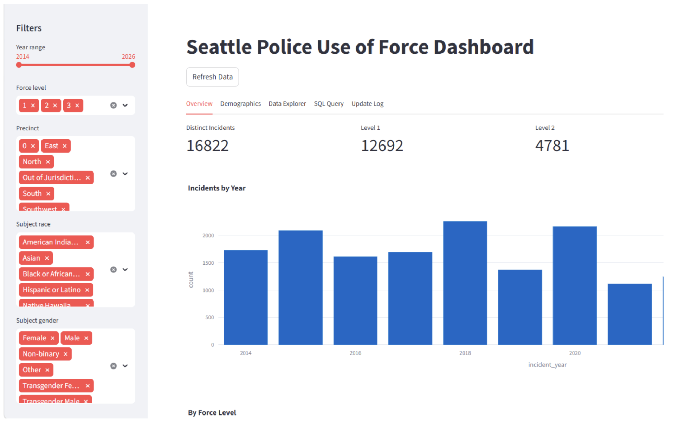

# Seattle PD Use of Force — Distributed Data Pipeline

An end-to-end data engineering pipeline and analytics dashboard for Seattle Police Department Use of Force incident data. Built as a containerized, production-modeled system using Docker Compose, PostgreSQL, and Streamlit.

---

## Project Overview

This project ingests, cleans, and serves ~19,000 Use of Force incident records from the Seattle Open Data portal. The pipeline follows a standard ETL architecture:

- **Extract** — paginated fetch from the Socrata SODA2 REST API
- **Transform** — standardization, date parsing, field normalization, deduplication
- **Load** — upsert into a normalized PostgreSQL star schema
- **Serve** — interactive Streamlit dashboard with filters, charts, and a SQL explorer

**Data Source:** [Seattle Open Data — Use of Force](https://data.seattle.gov/resource/ppi5-g2bj.json)  
**API:** Socrata SODA2 (`https://data.seattle.gov/resource/ppi5-g2bj.json`)  
**Records:** ~19,000 incidents (2014–present)

---

## Architecture

```
Seattle Open Data API (Socrata SODA2)
           │
           │ HTTP GET (paginated, 1000 records/batch)
           ▼
┌─────────────────────────────────────────────────────┐
│              Docker Compose Network                  │
│                                                     │
│  ┌──────────────────┐      ┌─────────────────────┐ │
│  │   etl container  │─────▶│    db container     │ │
│  │  pipeline.update │ SQL  │   postgres:16        │ │
│  │  runs on startup │      │   port 5432 (int)   │ │
│  └──────────────────┘      └──────────┬──────────┘ │
│                                        │ pgdata vol  │
│  ┌──────────────────┐                 │            │
│  │streamlit container│◀───────────────┘            │
│  │  streamlit_app.py │  SQL SELECT                 │
│  │  port 8501        │                             │
│  └──────────────────┘                             │
└─────────────────────────────────────────────────────┘
           │
           │ http://localhost:8501
           ▼
        Browser
```

Three containers, strict startup order: `db` (healthcheck) → `etl` + `streamlit` in parallel.

---

## Prerequisites

- [Docker Desktop](https://www.docker.com/products/docker-desktop/) (v24+)
- No Python installation required — everything runs inside containers

---

## Running with Docker Compose

**1. Clone the repo**
```bash
git clone https://github.com/alexphuongdao/d328_distributed_pipeline.git
cd d328_distributed_pipeline
```

**2. Create your environment file**
```bash
cp .env.sample .env
```
The defaults in `.env.sample` work out of the box for local development. No changes needed.

**3. Start the stack**
```bash
docker compose up --build
```

This will:
- Build the Python application image
- Start PostgreSQL (with a healthcheck)
- Run the ETL pipeline automatically — fetches all ~19,000 records from the API and loads them into PostgreSQL
- Start the Streamlit dashboard

The ETL typically takes 60–90 seconds on first run. You can watch progress with:
```bash
docker logs d328_distributed_pipeline-etl-1 -f
```

**4. Open the dashboard**

Once you see `Streamlit app running on port 8501` in the logs:

```
http://localhost:8501
```

---

## Stopping the App

```bash
docker compose down          # stop containers, keep data
docker compose down -v       # stop containers AND delete the database volume
```

---

## Refreshing Data

The dashboard has a **"Refresh Data"** button in the sidebar. Clicking it triggers a full upsert sync against the Seattle Open Data API — any new records are inserted, any corrections to existing records are updated. Designed for weekly use.

---

## Dashboard Screenshot



---

## Project Structure

```
d328_distributed_pipeline/
├── pipeline/
│   ├── extract.py       # Socrata API fetch with pagination + retry
│   ├── transform.py     # Data cleaning and normalization
│   ├── load.py          # PostgreSQL upsert with star schema
│   └── update.py        # ETL orchestrator (extract → transform → load)
├── db/
│   └── schema.sql       # PostgreSQL DDL (star schema)
├── streamlit_app.py     # Dashboard — 5 tabs, sidebar filters, SQL explorer
├── Dockerfile           # python:3.11-slim image
├── docker-compose.yml   # 3-service orchestration (db, etl, streamlit)
├── requirements.txt
└── .env.sample          # Environment variable template
```

---

## Database Schema

Star schema in PostgreSQL:

| Table | Type | Description |
|---|---|---|
| `incidents` | Fact | One row per UOF incident |
| `incident_types` | Lookup | Force level and type labels |
| `precincts` | Lookup | SPD precinct names |
| `sectors` | Lookup | SPD sector names |
| `races` | Lookup | Subject race categories |
| `genders` | Lookup | Subject gender categories |
| `update_log` | Audit | ETL run history with counts and status |

---

## Team

| Name | Role |
|---|---|
| **Alex Dao** | System architecture, ETL pipeline design, Docker orchestration |
| **Justin Gao** | Data cleaning strategy, validation rules, transform pipeline |
| **Zach Knight** | Streamlit dashboard design, data visualization, UX |
| **Sarthak Shelar** | Database schema design, SQL query optimization, testing |

---

## Future Work

- Incremental loading using Socrata `$where` watermark (currently full fetch + upsert on every run)
- Pandera schema validation with structured quality report stored in `update_log`
- Replace container DB with managed PostgreSQL (AWS RDS) for production deployment
- Apache Airflow DAG to replace manual cron scheduling when pipeline expands to multiple sources
- Supports repeatable batch updates with update logging.

## Project Layout

```
.
├── streamlit_app.py
├── Dockerfile
├── docker-compose.yml
├── .env.sample
├── db/
│   ├── schema.sql
│   └── seattle_uof.db
├── data/
│   ├── cleaned/
│   └── raw/
├── pipeline/
│   ├── __init__.py
│   ├── extract.py
│   ├── transform.py
│   ├── load.py
│   └── update.py
├── requirements.txt
└── README.md
```

## Setup

```bash
python -m venv .venv
source .venv/bin/activate
pip install -r requirements.txt
```

## Run

```bash
# Fetch raw data
python -m pipeline.extract

# Clean + load into SQLite
python -m pipeline.load

# Start dashboard
streamlit run streamlit_app.py

# Run manual batch update
python -m pipeline.update
```

## Docker

```bash
# Copy and edit environment variables
cp .env.sample .env

# Build and run the Streamlit dashboard
docker compose up --build

# Run a one-off ETL batch update
docker compose --profile etl run --rm etl
```
